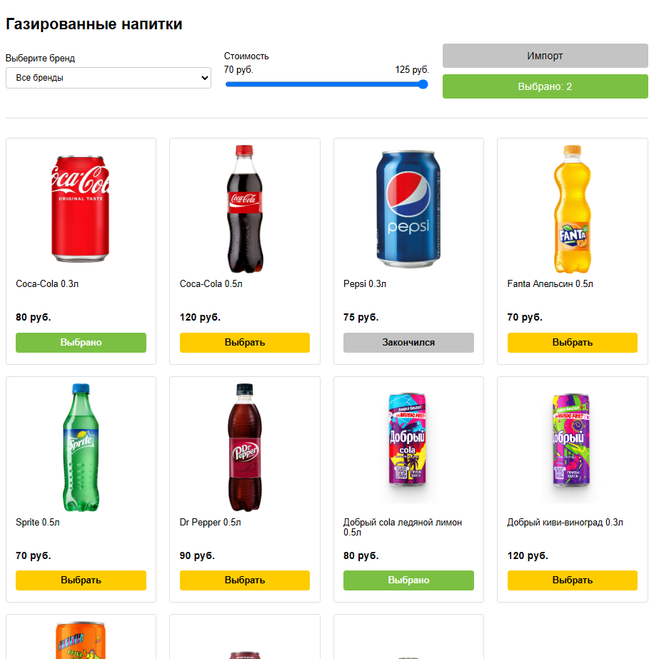

# 🥤 Автомат по продаже напитков (Drinkbox)


Проект реализует виртуальный автомат по продаже напитков на базе современных веб-технологий. Позволяет пользователям просматривать каталог, совершать покупки, оплачивать монетами и получать подтверждение о покупке.

---

## 🚀 Основные возможности
- **Интерактивный каталог**  
  Просмотр доступных напитков с изображениями, описаниями и ценами

- **Удобная корзина покупок**  
  Возможность добавления/удаления товаров и редактирования количества

- **Система оплаты монетами**  
  Эмуляция внесения монет номиналом 1, 2, 5, 10 руб. с расчетом сдачи

- **Импорт из Excel**  
  Автоматическая загрузка каталога товаров из XLSX-файлов

- **Подтверждение покупки**  
  Страница "Спасибо за покупку" с деталями заказа и оставшейся сдачей

---

## 📸 Скриншоты

> 💡 *Примеры интерфейса приложения:*

### Главная страница (каталог напитков)

  
### Корзина покупок

  
### Страница оплаты

  
### Страница "Спасибо за покупку"
  

## ⚙️ Используемые технологии
| Категория        | Технология                     |
|------------------|--------------------------------|
| Backend          | ASP.NET Core 9                 |
| ORM              | Entity Framework Core (Code First) |
| База данных      | MS SQL Server                  |
| Фронтенд         | HTML/CSS/JavaScript            |
| Асинхронность    | AJAX (fetch API)               |
| Работа с Excel   | DocumentFormat.OpenXml         |

---

## 📦 Установка и запуск

### Предварительные требования:
- [.NET 9 SDK](https://dotnet.microsoft.com/download/dotnet/9)
- MS SQL Server (локальный или облачный)

### Шаги:
1. Клонирование репозитория:
   ```bash
   git clone https://github.com/Fl1ckerxD/Drinkbox.git
   cd Drinkbox
   ```

2. Восстановление зависимостей:
   ```bash
   dotnet restore
   ```

3. Настройка БД:
   - Обновите строку подключения в `appsettings.json`
   - Выполните миграции:
     ```bash
     dotnet ef database update
     ```

4. Импорт данных из Excel:
   - Запустите импорт на главной странице

5. Запуск приложения:
   ```bash
   dotnet run
   ```

---

## 🗃️ Структура проекта
```
📦VendingMachine/
├── 📂 Core/                    # Доменные модели и интерфейсы
│   ├── 📂 DTOs/                # Data Transfer Objects
│   └── 📂 Entities/            # ORM-сущности
│
├── 📂 Infrastructure/          # Реализация репозиториев и сервисов
│   ├── 📂 Data/                # Контекст EF + миграции
│   ├── 📂 Repositories/        # Работа с БД
│   └── 📂 Services/            # Бизнес-логика
│
├── 📂 Web/                     # Веб-слои
│   ├── 📂 Components/          # View компоненты
│   ├── 📂 Controllers/         # MVC контроллеры
│   ├── 📂 Requests/            # DTO входящих запросов
│   ├── 📂 ViewModels/          # Модели представления
│   └── 📂 Views/               # Razor-шаблоны
└── Program.cs                   # Точка входа
```

---

## 🧪 Пример использования
1. Перейдите в каталог напитков
2. Выберите напитки и добавьте их в корзину
3. Перейдите к оплате и внесите монеты
4. Получите подтверждение покупки с указанием сдачи

---

## 📝 Примечания
- Для импорта Excel требуется файл с колонками: `ProductName`, `Price`, `Quantity`, `ImageUrl`, `BrandId`
- Система оплаты реализует алгоритм минимального количества монет для сдачи
- Поддерживается кэширование каталога для ускорения работы

---

## 📬 Связь

Если у вас есть вопросы или предложения, напишите мне:

- Email: mornival@outlook.com
- Telegram: @Fl1cker_0
